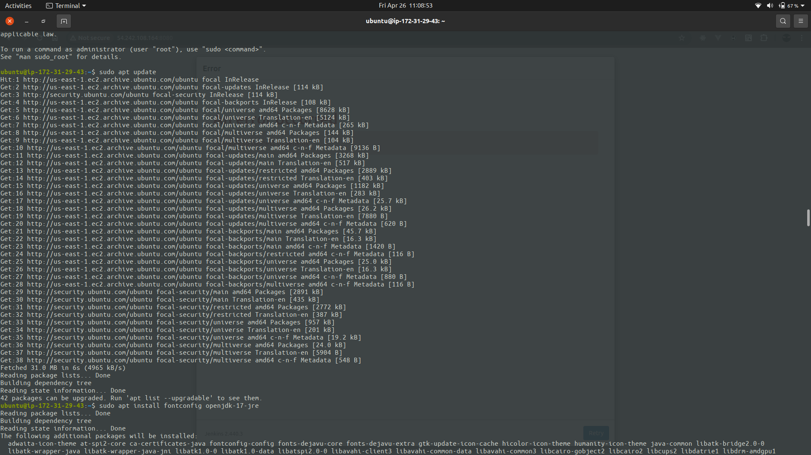
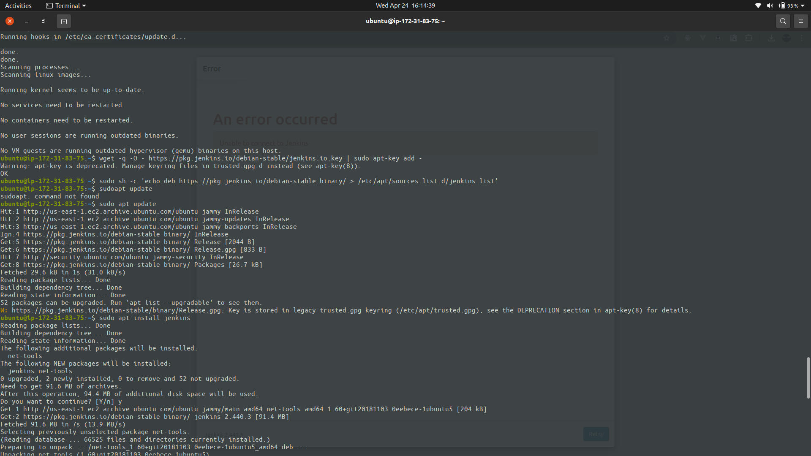
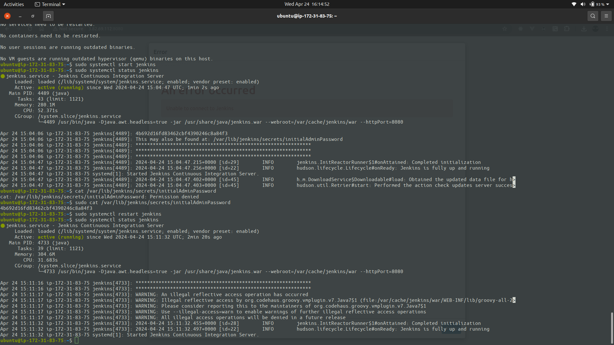
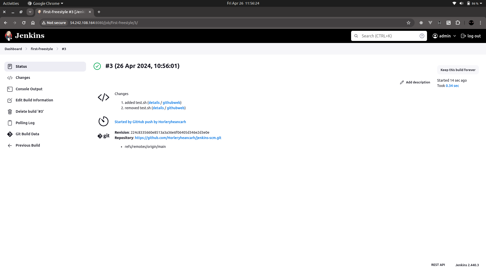
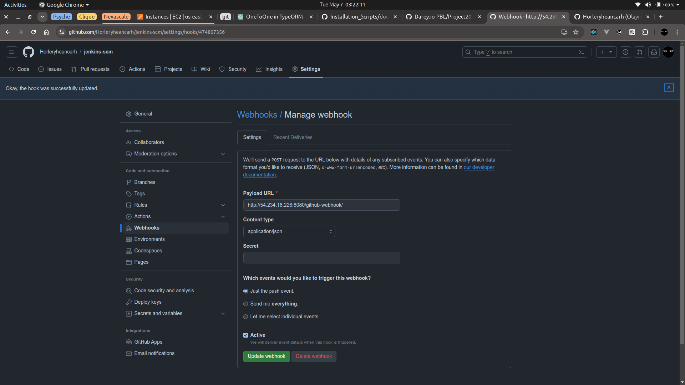
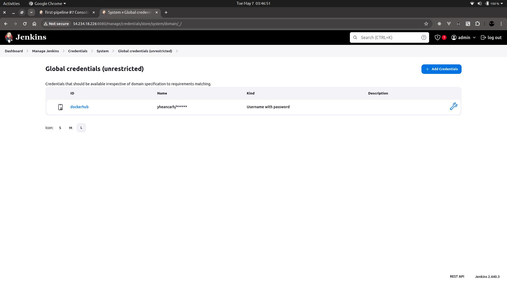
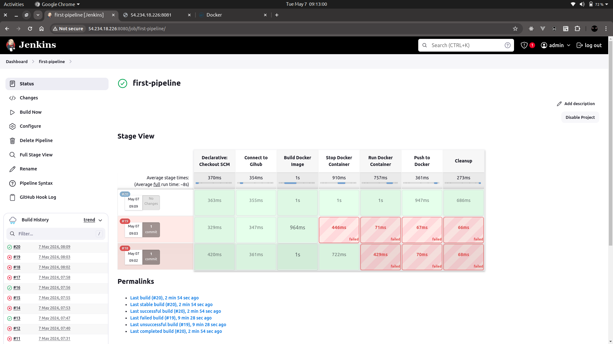
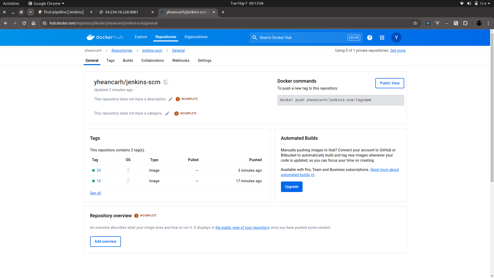
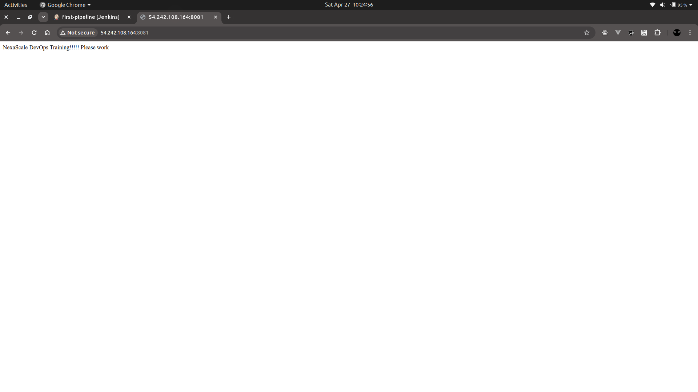

# Create Jenkins Server

## Install and Run Jenkins

```bash
  sudo apt update

  sudo apt install fontconfig openjdk-17-jre

  java -version

  sudo apt update 

  sudo wget -O /usr/share/keyrings/jenkins-keyring.asc https://pkg.jenkins.io/debian-stable/jenkins.io-2023.key
    
  echo "deb [signed-by=/usr/share/keyrings/jenkins-keyring.asc]"  https://pkg.jenkins.io/debian-stable binary/ | sudo tee  /etc/apt/sources.list.d/jenkins.list > /dev/null
    
  sudo apt update

  sudo apt install jenkins -y

  sudo systemctl start jenkins

  sudo systemctl enable jenkins

  sudo systemctl status jenkins

  sudo cat /var/lib/jenkins/secrets/initialAdminPassword
```




## Create a Freestyle Job



## Install And Run Docker

```bash
  sudo apt update -y

  sudo apt install apt-transport-https ca-certificates curl software-properties-common -y

  curl -fsSL https://download.docker.com/linux/ubuntu/gpg | sudo apt-key add -

  sudo add-apt-repository "deb [arch=amd64] https://download.docker.com/linux/ubuntu bionic stable" -y

  sudo apt update -y

  apt-cache policy docker-ce

  sudo apt install docker-ce -y

  sudo systemctl status docker

  sudo chmod 777 /var/run/docker.sock
```

## Create a Pipeline Job

### Pipeline Script
```groovy
pipeline {
  agent any

  environment {
		DOCKERHUB=credentials('dockerhub')
	}

  stages {
    stage('Connect to Gihub') {
      steps {
        git branch: 'main', url: 'https://github.com/Horleryheancarh/jenkins-scm.git'
      }
    }

    stage('Build Docker Image') {
      steps {
        script {
          sh 'docker build -t yheancarh/jenkins-scm:${BUILD_NUMBER} .'
        }
      }
    }

    stage('Stop Docker Container') {
      steps {
        script {
          sh 'docker stop test-app'

          sh 'docker rm test-app'
        }
      }
    }

    stage('Run Docker Container') {
      steps {
        script {
          sh 'docker run -itd -p 8081:80 --name test-app yheancarh/jenkins-scm:${BUILD_NUMBER}'
        }
      }
    }

    stage('Push to Docker') {
      steps {
        script {
          sh 'echo $DOCKERHUB_PSW | docker login -u $DOCKERHUB_USR --password-stdin'

          sh 'docker push yheancarh/jenkins-scm:${BUILD_NUMBER}'
        }
      }
    }

    stage('Cleanup') {
      steps {
        cleanWs(cleanWhenAborted: true, cleanWhenFailure: true, cleanWhenNotBuilt: true, cleanWhenUnstable: true, deleteDirs: true)
        
        sh 'docker logout'
        
        sh 'docker system prune -f'
      }
    }
  }
}
```




