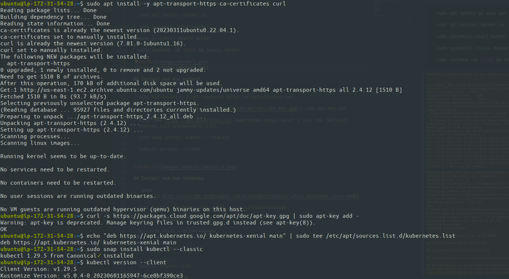

# Installing Minikube On Ubuntu

## Install and Run Docker

```bash
  sudo apt update && sudo apt upgrade

  sudo apt install docker.io

  sudo systemctl start docker

  sudo systemctl enable docker

  sudo usermod -aG $USER && newgrp docker
```


## Install and Run kubectl

```bash
  sudo apt install -y apt-transport-https ca-certificates curl

  curl -s https://packages.cloud.google.com/apt/doc/apt-key.gpg | sudo apt-key add -

  echo "deb https://apt.kubernetes.io/ kubernetes-xenial main" | sudo tee /etc/apt/sources.list.d/kubernetes.list

  sudo snap install kubectl --classic

  kubectl version --client
```



## Install and Run minikube

```bash
  curl -LO https://storage.googleapis.com/minikube/releases/latest/minikube-linux-amd64

  sudo install minikube-linux-amd64 /usr/local/bin/minikube

  minikube version

  minikube start --driver=docker

  # minikube test
  minikube status

  # kubectl test
  kubectl cluster-info

  kubectl config view

  kubectl get nodes

  kubectl get pods
```


