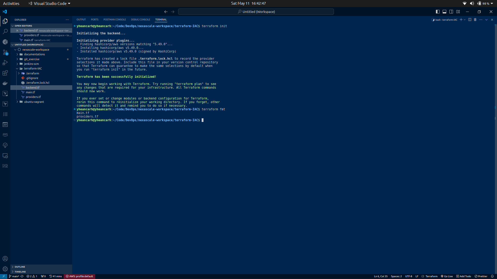
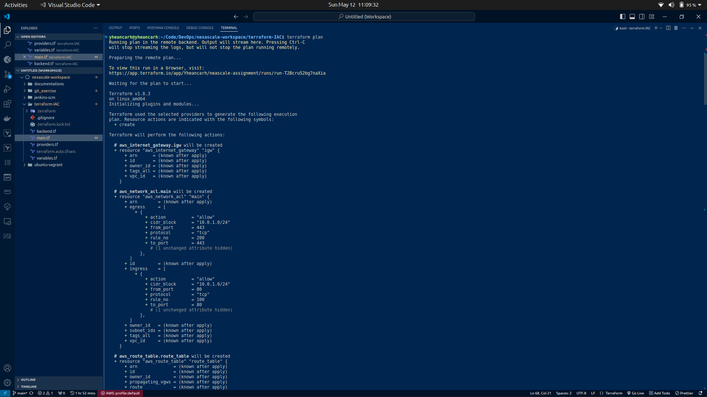
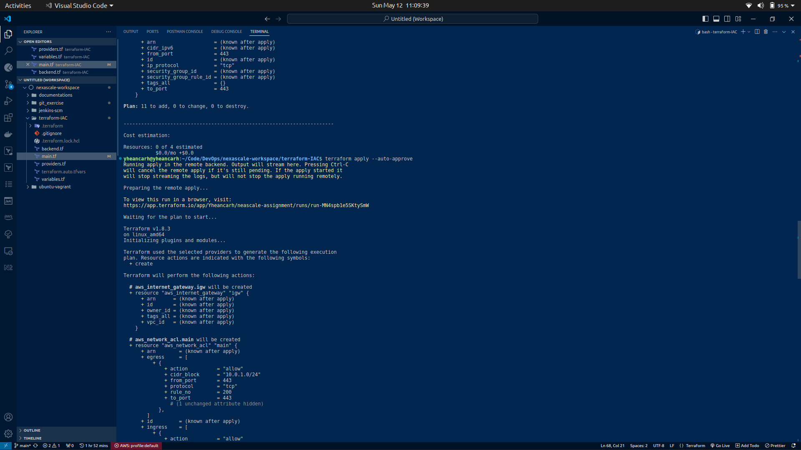
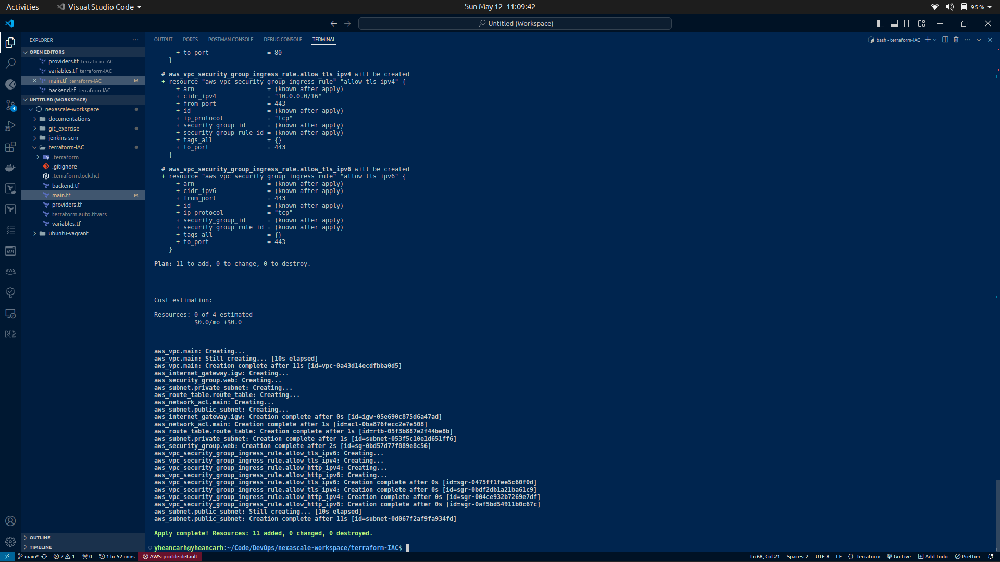
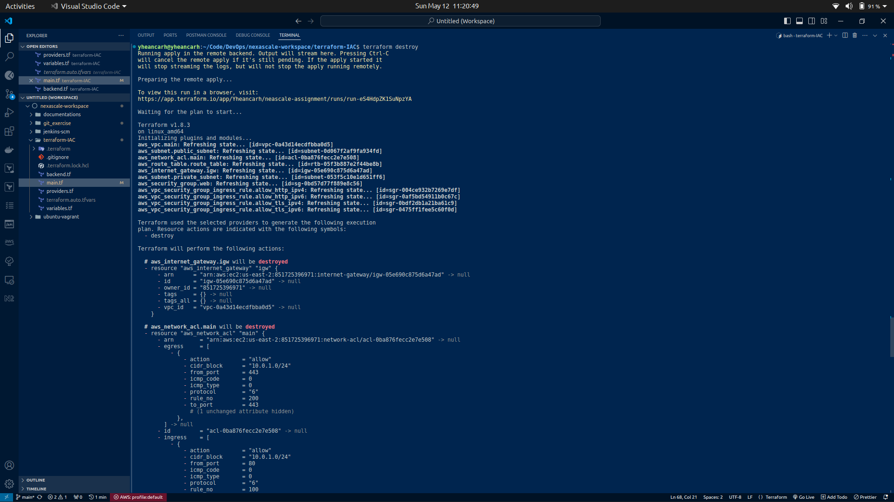
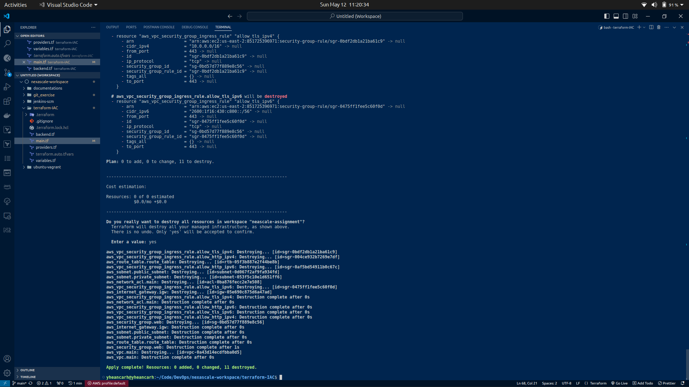

# Install Terraform

```bash
  sudo apt update
  
  sudo apt install -y gnupg software-properties-common

  wget -O- https://apt.releases.hashicorp.com/gpg | gpg --dearmor | sudo tee /usr/share/keyrings/hashicorp-archive-keyring.gpg > /dev/null

  gpg --no-default-keyring --keyring /usr/share/keyrings/hashicorp-archive-keyring.gpg --fingerprint

  sudo apt update

  sudo apt install terraform
```

###  Create VPC

```HCL
resource "aws_vpc" "main" {
  cidr_block                       = "10.0.0.0/16"
  assign_generated_ipv6_cidr_block = true
}
```

###  Create Subnet

For public subnet set map_public_ip_on_launch to true

```HCL
resource "aws_subnet" "private_subnet" {
  vpc_id                  = aws_vpc.main.id
  cidr_block              = "10.0.1.0/24"
  map_public_ip_on_launch = false
}
```

### Create Internet Gateway

```HCL
resource "aws_internet_gateway" "igw" {
  vpc_id = aws_vpc.main.id
}
```
### Create Route Table

```HCL
resource "aws_route_table" "route_table" {
  vpc_id = aws_vpc.main.id
}
```

### Create Security Group

```HCL
resource "aws_security_group" "web" {
  vpc_id = aws_vpc.main.id
}
```

### Create Network ACL

```HCL
resource "aws_network_acl" "main" {
  vpc_id = aws_vpc.main.id

  egress {
    protocol   = "tcp"
    rule_no    = 200
    action     = "allow"
    cidr_block = "10.0.1.0/24"
    from_port  = 443
    to_port    = 443
  }

  ingress {
    protocol   = "tcp"
    rule_no    = 100
    action     = "allow"
    cidr_block = "10.0.1.0/24"
    from_port  = 80
    to_port    = 80
  }
}
```

## Running the Terraform code

### Plan

```bash
terraform init

terraform plan
```





### Apply Configuration

```bash
terraform apply --auto-approve
```





### Destroy Resources

```bash
terraform destroy
```





### State Files

State files provide a vital link between the configurations defined in Terraform files and the real-world resources they represent. By maintaining a record of the actual resources provisioned based on these configurations, state files enable Terraform to accurately track the state of the infrastructure. Additionally, they store metadata crucial for understanding resource dependencies, attributes, and relationships. This information is instrumental in Terraform's ability to determine changes needed to achieve the desired infrastructure state. Moreover, by storing state locally or remotely, such as in Terraform Cloud or AWS S3, state files enhance performance, particularly for managing large-scale infrastructures. Overall, state files play a pivotal role in facilitating safe, efficient, and reliable infrastructure management practices. It's imperative to handle state files with care, ensuring proper versioning, backup procedures, and access controls to maintain the integrity of the infrastructure management workflow.

### [Link to terraform code](https://github.com/Horleryheancarh/terraform-IAC)