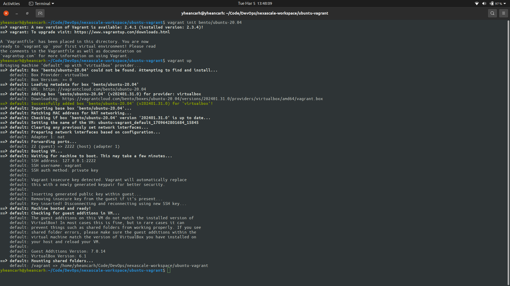

# Create Ubuntu Server with Vagrant

```bash
  # Create the machine
  vagrant init bento/ubuntu-20.04

  # Start the machine
  vagrant up

  # Log into the machine
  vagrant ssh

  # Stop the machine
  vagrant halt 
```



[Visit here to download and install Vagrant](https://developer.hashicorp.com/vagrant/install)
